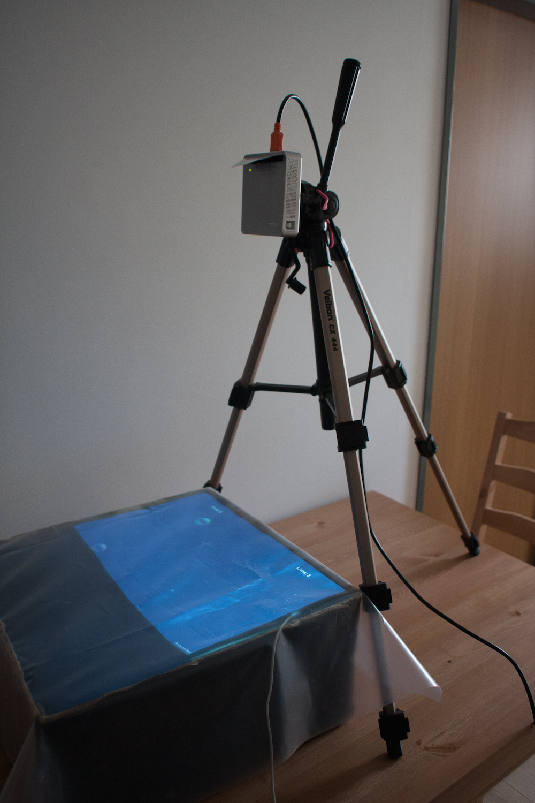
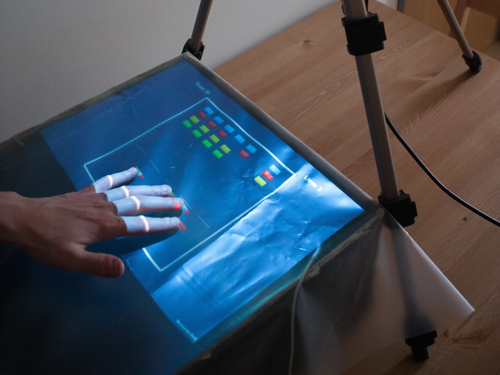

# Games interface and game prototypes using Leap Motion and data projector

For my bachelor's thesis (in czech language) I designed simple device for playing games using Leap motion hand sensor and data projector working around limitations of Leap motion.

Work included simple calibration application and few game prototypes using Unity game engine.

[Thesis page](http://www.fit.vutbr.cz/study/DP/BP.php?id=17327)

## Images

